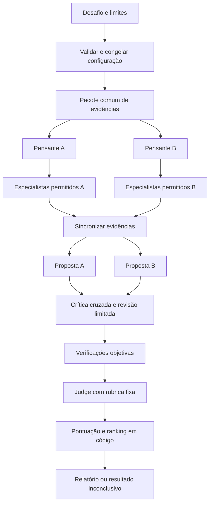

# Agentathon — Arquitetura e especificação do MVP

Versão 1.0 · 30/09/2026 · Documento de produto e implementação para o Devin.

**Status:** arquitetura proposta, ainda não implementada. Requisitos do produto vêm da conversa; tecnologias, limites numéricos e recorte do MVP abaixo são decisões propostas para tornar o desenvolvimento executável. Não apresentar funcionalidades planejadas como entregues.

## 1. Instrução de execução para o Devin

Construa o MVP descrito neste documento em incrementos funcionais. Comece inspecionando o repositório e suas instruções; preserve trabalho existente. Se o repositório estiver vazio, use a estrutura da seção 16. Primeiro entregue o fluxo completo em modo simulado; depois conecte inferência real e finalize a interface.

Não expanda o escopo para um SaaS empresarial completo. Tome decisões locais de implementação e registre desvios relevantes em `README.md`. Peça esclarecimento somente quando faltar uma decisão que impeça o funcionamento; credenciais ausentes devem bloquear apenas a integração correspondente, mantendo o modo simulado utilizável.

Este arquivo define o produto desejado. Devin, Claude Code e Codex são ferramentas de desenvolvimento; a aplicação executará seu próprio backend e utilizará APIs de inferência.

## 2. Produto, cliente e proposta de valor

**Agentathon é uma plataforma que executa um hackathon entre equipes de agentes de IA: recebe um desafio, gera propostas concorrentes, permite crítica e revisão limitadas e entrega uma avaliação rastreável segundo critérios e orçamento definidos.**

O cliente pode ser outro agente, que precisa contratar uma análise comparativa por API, ou uma pessoa usando a interface. O usuário define objetivo, evidências, restrições e recursos disponíveis; o sistema conduz a execução sem exigir escolhas humanas entre cada etapa.

A dor: gerar uma resposta é fácil; construir alternativas comparáveis, verificar premissas e justificar uma escolha exige trabalho. O valor buscado é reduzir esse trabalho e tornar os motivos da recomendação inspecionáveis. Qualidade superior, redução de custo e economia de tempo são hipóteses a medir, não garantias.

Entrada: problema + contexto + restrições + critérios + orçamento. Saída: propostas, notas, justificativas, evidências, incertezas, consumo e recomendação ou resultado inconclusivo. O produto entrega apoio à decisão; não executa automaticamente a solução vencedora.

O nome da plataforma inteira é **Agentathon**. Anubis, trIAl e Coliseum foram alternativas de nome e não representam módulos obrigatórios.

## 3. Alinhamento com o hackathon

Fonte: PDF fornecido pelo usuário, `2026.09.19 NeuraLake_Launch_Hackathon_Challenges_vfinal (PT) (1).pdf`, especialmente páginas 3–11. O material prevê escolher **um desafio principal**. Enquadramento proposto:

| Frente | Relação com Agentathon | Tratamento no MVP |
|---|---|---|
| 05 — Agent Trust & Verification | Verificar entregas de agentes e registrar decisões, modelos, motivos e custos. | Frente principal recomendada; avaliação, verificação e auditoria são centrais. |
| 03 — Agent-to-Agent Economy | Delegação sob orçamento e custo visível. | Controle de inferência real; transações entre agentes podem ser uma extensão simulada. |
| 04 — Agent-First Product | Outro agente solicita e recebe a análise sem operar uma tela. | API ponta a ponta e cliente de exemplo; uso sem tela possível, com UI customizada ainda obrigatória no produto. Isso, sozinho, não comprova atender todo o desafio 04. |
| 02 — Agent Marketplace | Descoberta e contratação autônoma de especialistas. | Catálogo interno limitado; marketplace aberto fica fora do MVP. |

Critérios do **júri do evento**, conforme página 11: autonomia A2A 30%; demo funcionando 25%; eficiência/valor por token 15%; valor de negócio 15%; pitch 10%; confiança/explicabilidade 5%. Esses pesos não são a rubrica interna que o Judge usa para comparar propostas.

Priorizar NeuraLake como integração de inferência da demonstração. A página pública da API descreve compatibilidade com OpenAI, `model="auto"` e seleção por capacidade. Cross Memory exige confirmar o contrato técnico e o isolamento de sessões antes de implementar; não inventar parâmetros ou alegar economia não medida.

Uma API JSON utilizável por agentes constitui uma interface para agentes. Conformidade com o **protocolo Agent2Agent (A2A)** é uma implementação adicional e não deve ser anunciada apenas porque há vários agentes no backend.

## 4. Escopo e prioridades

| Prioridade | Entregas |
|---|---|
| **P0 — MVP obrigatório** | Desafio estruturado; texto e PDF textual; pacote comum de evidências; 2–4 candidatos configuráveis; delegação limitada; crítica/revisão opcional; Judge; ranking calculado em código; limites de custo e execução; histórico; UI customizada; API completa; exportação JSON/Markdown; modos simulado e real. |
| **P0 — Integrações** | Adaptador simulado e adaptador NeuraLake; interface de provedores desacoplada; catálogo configurável. Diferentes configurações/modelos/capacidades por papel quando o provedor permitir. |
| **P1 — Após o fluxo completo** | Um segundo provedor nativo, como Anthropic ou OpenAI, conforme credenciais; comparação com agente único; descoberta e contratação dinâmica por competência/preço; ledger de contratação simulado; Cross Memory validado. |
| **Futuro** | Protocolo A2A completo; MCP; marketplace externo; reputação histórica; múltiplas organizações; pagamentos; retomada automática de jobs; RAG vetorial; conectores corporativos. |

Não implementar no MVP: treinamento de modelos, carteira real, blockchain, Kubernetes, agentes distribuídos em vários servidores, navegador irrestrito, execução de código criado pelo modelo ou um editor visual completo de workflows.

## 5. Experiência de uso e interface

### 5.1 Configurar um desafio

Tela principal com problema, contexto, anexos, restrições obrigatórias, critérios/pesos e orçamento. Diferenciar claramente **número de candidatos**, **especialistas disponíveis** e **limite de chamadas**.

Cada candidato tem nome, instruções estratégicas editáveis, provedor/modelo ou capacidade, ferramentas autorizadas e limite de delegação. Presets sugeridos: equilíbrio, custo e robustez. Todos respondem ao mesmo desafio e à mesma rubrica, mesmo tendo abordagens diferentes.

Oferecer dois modos de configuração:

- **Automático:** usuário informa objetivo e limites; o pensante propõe tarefas e regras predefinidas escolhem especialistas/opções dentro de um catálogo fixo permitido. Essa seleção limitada é P0; descoberta/contratação dinâmica é P1. É o modo preferido para a demonstração de autonomia.
- **Manual:** usuário fixa participantes, modelos e estratégias antes de iniciar, para experimentação e comparação. Não é evidência de contratação autônoma entre agentes.

Não exigir configuração avançada para executar o exemplo. Seletores exibem apenas opções habilitadas no servidor; ausência de credencial aparece como integração indisponível. NeuraLake `auto`/capacidades devem ser identificados como roteamento/capacidades, sem fingir que são modelos fixos conhecidos.

### 5.2 Acompanhar e comparar

- Execução: etapas e cards dos candidatos, especialistas acionados, status, tempo, orçamento reservado e gasto conhecido/estimado. Progresso por eventos reais, sem porcentagem fictícia.
- Resultado: propostas lado a lado, ranking, notas por critério, violações, fontes e justificativas. Exibir propostas desclassificadas com o motivo.
- Histórico: reabrir execução, consultar configuração congelada e exportar relatório JSON ou Markdown.
- Controles: cancelar; duplicar a configuração em uma nova execução; abrir referências. Não editar critérios de uma execução em andamento.

Visual de arena de trabalho: cards legíveis, hierarquia clara, tabela de pontuação e detalhes expansíveis. Português como idioma inicial. Cores distinguem candidatos, com texto/ícones para status. Não depender de animações ou de um chat genérico como interface principal.

### 5.3 Uso por outro agente

Disponibilizar descoberta via catálogo e OpenAPI, criação do desafio por HTTP e consulta do resultado estruturado. Um script cliente deve completar essa jornada sem navegador. A UI consome a mesma API e as mesmas regras. Autonomia da análise não significa autorização para realizar compras, publicar conteúdo ou implantar a proposta vencedora.

## 6. Stack e infraestrutura

| Camada | Escolha proposta | Responsabilidade |
|---|---|---|
| Interface | TypeScript, React e Next.js | Configuração, acompanhamento e comparação. |
| Backend | Python e FastAPI | API, validação, permissões, jobs, limites e relatórios. |
| Orquestração | LangGraph em Python | Estados e transições do fluxo; paralelismo controlado. |
| Contratos | Pydantic e JSON Schema/OpenAPI | Validar entradas e saídas; gerar tipos para o frontend. |
| Persistência | SQLite com SQLAlchemy e migrações | Execuções, artefatos, eventos, custos e configurações. |
| Empacotamento | Docker Compose | Frontend e backend; volume persistente para banco/anexos. |

Um backend e um executor limitado são suficientes para o MVP. Usar um processo de backend, inicialmente uma execução ativa por instância, com paralelismo de chamadas dentro dela. Persistir a fila no banco. Não manter toda a arena dentro da duração de uma requisição HTTP.

LangGraph não substitui a implementação do orçamento, da auditoria ou da segurança. No MVP, persistir transições e resultados explicitamente; se o servidor reiniciar, marcar jobs ativos como interrompidos, sem repetir chamadas automaticamente. Checkpoints com retomada segura podem vir depois.

Não é necessário um servidor por agente nem GPU própria quando a inferência vem de APIs. Para publicar, usar HTTPS, autenticação, armazenamento persistente e segredos no backend. SQLite exige uma única instância com disco persistente; migração para PostgreSQL é evolução para maior concorrência, não pré-requisito da demo.

## 7. Fluxo de execução

Os especialistas são opcionais: quando delegar não se justificar, o pensante aguarda a sincronização comum das evidências e consolida sua proposta. Dois candidatos no desenho representam o padrão; a configuração permite até quatro.

1. Validar desafio, pesos, catálogo, permissões, fontes, limites e orçamento. Congelar um snapshot com hashes das instruções, rubrica, preços e configuração.
2. Extrair/organizar as fontes uma vez. Produzir `EvidencePack`, com identificadores estáveis, localizadores e lacunas.
3. Executar os pensantes independentemente. Cada um devolve plano estruturado e até o limite permitido de tarefas especializadas.
4. O coordenador verifica o plano, seleciona recursos permitidos e reserva orçamento. Executa especialistas e reúne seus resultados, mantendo estratégias privadas separadas das derivações factuais compartilháveis.
5. Sincronizar as evidências: validar derivações compartilháveis, congelar a versão final do pacote e entregá-la a todos os pensantes antes da consolidação das propostas iniciais. Cada pensante consolida sua proposta. Se crítica estiver habilitada, cada candidato recebe a proposta de outro em um anel determinístico, emite crítica referenciada e recebe a crítica dirigida à sua própria proposta. Com dois candidatos, a crítica é recíproca. A ordem é registrada.
6. Quando a rodada estiver habilitada, cada candidato pode revisar sua proposta uma vez. A revisão não abre nova rodada de especialistas no MVP.
7. Executar verificações objetivas e avaliar as propostas finais sob a mesma rubrica. O Judge não participa das estratégias dos competidores.
8. Calcular notas e elegibilidade no backend; salvar relatório, trilha de execução e consumo. Pode não existir vencedor.

Os agentes não precisam concordar com o resultado. Preservar divergências e limitações, sem loop até consenso. Uma nova rodada completa requer outra execução, com orçamento próprio.

## 8. Papéis e responsabilidades

| Componente | Função | Limite de autoridade |
|---|---|---|
| Coordenador em código | Controlar estado, recursos, eventos e persistência. | Único componente que autoriza chamadas e aplica limites. |
| Camada de evidências | Extrair documentos e organizar fatos, hipóteses e lacunas. | Não transformar afirmação de documento em fato verificado automaticamente. |
| Pensante de cada candidato | Planejar, solicitar especialistas e consolidar proposta. | Não criar ferramentas, modelos, permissões ou orçamento. |
| Especialistas | Pesquisa nos documentos, cálculo ou análise pontual. | Tarefas limitadas, contexto mínimo e saída estruturada. |
| Crítico | Identificar fragilidades de outra proposta. | Apresentar objeções e fontes; não alterar rubrica. |
| Judge | Avaliar aderência, evidências e trade-offs por critério. | Não redefinir pesos, executar ações ou declarar custos desconhecidos como zero. |
| Motor de ranking | Aplicar restrições e fórmula de pontuação. | Código determinístico; não aceitar ranking textual como resultado oficial. |

O “agente de cálculo” deve usar funções numéricas pré-definidas e entradas tipadas. Não usar `eval`, shell ou execução arbitrária de código produzido pelo modelo. Para pesquisa, limitar o MVP aos arquivos/textos fornecidos; busca externa é extensão explícita.

Um agente é uma configuração de modelo, instruções, ferramentas, contexto e limites. O modelo sugere a delegação por saída estruturada; o programa realiza a chamada. Uma instrução como “use um modelo mais barato” sozinha não implementa roteamento nem controle financeiro.

## 9. Evidências e isolamento de contexto

Aceitar texto colado, Markdown/TXT e PDF com camada textual. Defaults propostos: até 5 anexos, 10 MiB por arquivo e 100 páginas por PDF. Rejeitar arquivos acima do limite; explicar quando um PDF exige OCR, fora do MVP. Truncamentos ou trechos omitidos devem ser visíveis.

Cada evidência deve conter `evidence_id`, `source_id`, trecho, página/seção/linhas, tipo (`source_claim`, `derived_calculation`, `assumption`) e proveniência. Cálculos derivados registram entradas, unidades, fórmula/função e IDs das fontes de entrada.

Os candidatos recebem a mesma versão do pacote. Não compartilham rascunhos antes da crítica. O Judge recebe propostas finais anonimizadas, sem marca do modelo, e o mesmo pacote; a ordem dos candidatos é embaralhada com seed registrada para reduzir viés de posição. Isso reduz alguns vieses, sem garantir imparcialidade.

No MVP, especialistas recuperam trechos do corpus comum e fazem derivações; não introduzem pesquisa externa privada. Há uma única barreira de atualização: depois dos especialistas e antes da consolidação das propostas iniciais, o coordenador valida e incorpora derivações compartilháveis, congela a versão final e a disponibiliza a todos. Estratégias/raciocínios privados não entram nesse pacote. Descoberta material posterior vira limitação e sugestão de nova execução, sem abrir outro loop; se ela inviabilizar a avaliação, retornar resultado inconclusivo. Essa barreira permite comparar propostas mesmo com zero rodadas de crítica/revisão.

Uma referência existente pode não sustentar a afirmação. Validar IDs em código e usar o Judge para avaliar suporte semântico, mantendo a possibilidade de erro. Ausência de evidência vira lacuna ou hipótese explícita.

## 10. Judge, restrições e ranking

### 10.1 Rubrica interna padrão

Pesos editáveis antes de iniciar; exigir soma igual a 100 e notas de 0 a 10. Default inspirado no desenho fornecido:

| Critério | Peso | Avaliação |
|---|---:|---|
| Aderência ao objetivo e às premissas | 30 | Responde ao pedido e respeita as condições. |
| Qualidade das evidências | 25 | Fontes pertinentes e afirmações sustentadas. |
| Consistência do raciocínio apresentado | 20 | Justificativa coerente, sem contradições ou inferências indevidas. |
| Completude | 10 | Cobre entregáveis, dependências e passos necessários. |
| Eficiência da execução | 10 | Consumo da equipe em relação à cota, pela fórmula abaixo; qualidade é pontuada nos demais critérios. |
| Tratamento de incertezas | 5 | Explicita limites, hipóteses e dados ausentes. |

Régua padrão de eficiência: `grade_efficiency_i = 10 * max(0, 1 - cost_i / quota_i)`, com cotas positivas e iguais por padrão. `cost_i` inclui planejamento, especialistas, consolidação, crítica emitida, revisão e tentativas atribuídas à equipe; preparação comum e Judge são reportados à parte. Isso mede consumo relativo, sem alegar medir qualidade por si só. A nota é calculada pelo servidor e não pode ser alterada pelo Judge. Separar esse consumo do custo de implementar a solução proposta.

Usar custos na mesma moeda e snapshots de preços compatíveis, com a qualidade da medição identificada. Estimativas calculadas a partir de uso reportado e preços conhecidos podem gerar ranking identificado como estimado; consumo necessário desconhecido impede nota completa e vencedor oficial (`inconclusive`). Alternativamente, definir uma rubrica sem eficiência antes de iniciar. Não renormalizar pesos silenciosamente no final.

Para cada candidato: `score_0_100 = sum(weight_i * grade_i) / 10`. Validar critérios completos, pesos e notas; calcular com precisão decimal e arredondar apenas para exibição.

### 10.2 Elegibilidade antes de pontuação

Restrições obrigatórias verificáveis têm regra tipada, unidade e evidência: por exemplo, prazo máximo ou valor máximo de uma alternativa. Resultado por restrição: `pass`, `fail` ou `unknown`. O backend não deve considerar uma alegação do candidato como prova.

- Qualquer `fail` obrigatório confirmado: candidato inelegível, independentemente da pontuação.
- Qualquer `unknown` obrigatório: candidato pendente; pode ter nota diagnóstica, mas não ser vencedor validado.
- Condições sem verificador objetivo: avaliação semântica pode informar notas qualitativas, mas não satisfaz uma restrição obrigatória verificável. Se o chamador insistir em mantê-la como obrigatória sem prova disponível, o resultado será `unknown`, com candidatura pendente; explicitar essa consequência na validação inicial.
- Nenhum elegível: `decision_status = no_eligible_candidate` ou `inconclusive`, com motivos.

Não converter texto livre em restrição eliminatória sem normalização validada no início. O usuário/agente chamador pode fornecer restrições estruturadas ou manter uma condição como critério qualitativo.

### 10.3 Saída do Judge

Retornar JSON validado: notas por critério, justificativas curtas, referências, objeções, hipóteses e incertezas. O Judge não recebe segredos, instruções privadas dos candidatos nem a capacidade de alterar configurações. Justificativas são resumos verificáveis, não cadeia de pensamento interna.

Empate na pontuação não é quebrado arbitrariamente: exibir co-liderança, com ordem visual estável por ID. Um primeiro colocado relativo não significa aprovação absoluta. Caso exista um limiar mínimo de qualidade, ele deve estar no snapshot inicial; o default é não inventar um limiar universal.

Falha de schema permite no máximo uma reparação por chamada lógica, sujeita ao limite global. Se o Judge falhar, preservar propostas e retornar avaliação incompleta, sem fabricar ranking ou vencedor.

## 11. Custo, roteamento e limites

### 11.1 Defaults propostos

| Parâmetro | Default | Limite do MVP |
|---|---:|---:|
| Candidatos | 2 | 2–4 |
| Tarefas especializadas por candidato | Até 2 | 2 no total, sem recursão |
| Rodadas de crítica/revisão | 1 | 0–1 |
| Chamadas de inferência simultâneas | 2 | 4 |
| Tentativas por chamada lógica | Até 2 | Inicial + uma repetição ou reparação |
| Chamadas totais por execução | 32 | Todas as tentativas contam |
| Prazo da execução | 300 s | Configurável pelo servidor |
| Timeout por chamada | 60 s | Limitado também pelo prazo restante |

Orçamento monetário não tem default universal. Em modo real, exigir teto explícito e validar se há recursos para uma execução mínima. Cada papel tem teto de contexto e saída configurado segundo a capacidade do provedor; erro de contexto não autoriza truncamento silencioso.

Planejar recursos para evidências, candidatos e avaliação final antes de iniciar. Dividir o orçamento em cota comum e cotas por candidato, iguais por padrão; diferenças intencionais devem aparecer na configuração e no relatório. Cada cota protege os valores e slots de chamadas necessários à consolidação e avaliação. O total de 32 chamadas é um teto, não um objetivo de consumo. Cortar etapas opcionais segundo política comum, por exemplo desabilitar a rodada para todos, sem favorecer quem solicitar recursos primeiro; registrar a mudança operacional, mantendo a rubrica intacta.

### 11.2 Reserva e reconciliação

Antes de cada chamada, estimar um limite conservador de cobrança a partir de entrada, saída máxima, tokens adicionais cobrados pelo provedor, ferramentas e tabela de preços versionada. Reservar o valor em transação atômica no bucket da etapa/equipe. A soma de gasto contabilizado, reservas de chamadas e provisões para etapas futuras não pode ultrapassar o teto; transformar uma provisão em reserva, sem contar duas vezes. Especialistas e repetições só consomem saldo e slots livres depois das proteções de finalização. Validar também chamadas restantes, estado do job e prazo antes de admitir trabalho.

Ao terminar, conciliar com o uso informado e liberar apenas a reserva comprovadamente excedente. Se houve timeout com consumo desconhecido, manter a reserva como pendente, inclusive após o término do job. Não reutilizar automaticamente cotas não gastas de um candidato para outro. Cancelar impede novas chamadas; não desfaz cobrança de requisições já enviadas. Atingir qualquer limite termina as etapas restantes como parciais, sem ultrapassar limites para tentar reparar a execução.

Não prometer teto financeiro estrito se o provedor não oferecer informações suficientes para limitar a cobrança. Nesse caso, bloquear o modo de orçamento estrito para essa configuração ou apresentar explicitamente orçamento indicativo, mantendo limites de tokens/chamadas/tempo. Não substituir custo desconhecido por zero.

Para `auto`, usar um teto de preço conhecido das rotas permitidas ou deixar explícito que o valor é estimado. Se o uso real exceder a reserva, registrar o fato, bloquear novas chamadas e marcar o limite como excedido; não ocultar a diferença.

### 11.3 Contabilidade e economia

Registrar provedor, opção solicitada, modelo efetivamente informado ou `unknown`, tokens reportados/estimados, preço aplicado, latência, tentativas e custo. Separar `provider_reported`, `estimated` e `unknown`; preço × tokens é estimativa, não fatura confirmada.

O custo total inclui preparação, todos os candidatos, especialistas, críticas, revisões, Judge e tentativas com cobrança. Custos comuns ficam separados dos custos por candidato. Nunca reportar apenas o custo da proposta vencedora como custo da arena.

Economizar com extração única, tarefas simples em capacidades adequadas, contexto relevante, delegação limitada e persistência de artefatos. Cache de extração usa hash do conteúdo e versão do extrator. Não reutilizar respostas entre candidatos independentes de forma que simule diversidade.

Pagamentos entre agentes, se implementados em P1, usam ledger de créditos fictícios separado dos custos reais de inferência. Rejeitar uma entrega não reembolsa tokens já consumidos. Cache local também não deve ser apresentado como Cross Memory da NeuraLake.

## 12. Adaptadores de inferência

Interface interna sugerida: `generate(request) -> result`, com mensagem/instruções, schema esperado, modelo/capacidade, limites e contexto autorizado. A resposta normalizada inclui conteúdo, uso, modelo informado, request ID, latência e erro tipado.

Catálogo no servidor: provedor, ID permitido, capacidades, limites, preços/versionamento e recursos suportados, como streaming, JSON estruturado ou ferramentas. Preferir saída estruturada nativa; quando indisponível, solicitar JSON e validar no backend. Não assumir compatibilidade idêntica entre modelos.

- **MockAdapter:** determinístico, sem rede, cobre sucesso, inelegibilidade, dados insuficientes e falha.
- **NeuraLakeAdapter:** prioridade da integração real. A referência pública consultada indica base `https://api.neuralake.cloud/v1`, `chat/completions` e opções `auto`, `text`, `code`, `reasoning`, `reasoning-pro`, `multimodal`. Confirmar acesso, parâmetros, preços, usage e recursos no ambiente antes de afirmar compatibilidade testada.
- **Segundo provedor:** extensão via contrato comum. IDs reais devem vir de configuração/documentação atual; não usar nomes hipotéticos de modelos. A primeira demo pode usar apenas um provedor, e deve declarar a diversidade que foi efetivamente observada.

Um roteador `auto` pode escolher o mesmo modelo para várias tarefas; isso não comprova diversidade de LLMs. Guardar informação desconhecida como desconhecida.

Cross Memory: implementar somente com contrato confirmado de sessão, leitura/escrita e isolamento por execução/candidato. Compartilhar evidências comuns sem vazar estratégias entre concorrentes. Se o isolamento não estiver disponível, manter contextos separados e desabilitar essa integração no MVP.

Não fazer fallback silencioso de uma chamada real para mock, outro modelo ou outro provedor. Mudanças de provedor precisam estar previamente autorizadas na configuração; o default é fallback desabilitado.

## 13. Dados e contratos

Persistir os objetos abaixo. IDs gerados pelo servidor; timestamps UTC; dinheiro em decimal ou unidade inteira mínima, nunca ponto flutuante binário.

| Objeto | Campos essenciais |
|---|---|
| `ChallengeConfig` | objetivo, contexto, fontes, restrições tipadas, rubrica, orçamento, limites, participantes, Judge, modo. |
| `AgentConfig` | papel, instruções/versionamento, provedor/opção, ferramentas e limites autorizados. |
| `Run` | proprietário, status, snapshot imutável, hashes, seed, datas, orçamento, versão do aplicativo. |
| `EvidencePack` | versão, fontes, trechos, localizadores, derivações, hipóteses e lacunas. |
| `TaskPlan` | tarefas, competência necessária, agente solicitado, dependências, justificativa resumida. |
| `TaskResult` | tarefa, status, entrega estruturada, evidências, verificação e uso associado. |
| `Proposal` | candidato, versão, recomendação, passos, premissas, trade-offs, riscos, evidências e pendências. |
| `Evaluation` | versão da proposta/rubrica/pacote, restrições, notas, justificativas, status. |
| `CallUsage` | chamada/tentativa, reserva, provedor, modelo, tokens, preço, custo, request ID e erro. |
| `RunEvent` | sequência, tipo, data, run ID e payload sanitizado. |
| `Report` | classificação, decisão, alternativas, evidências, limitações, consumo e próximos passos. |

Campos desconhecidos ficam `null` com explicação; não preencher números fictícios em execução real. JSON Schema e tipos devem vir da mesma fonte para evitar divergência entre frontend e backend.

Estados do job: `queued`, `running`, `completed`, `partial`, `failed`, `cancelled`, `interrupted`. `completed` significa que o fluxo terminou, não que uma proposta foi aprovada. Resultado separado em `decision_status`: `ranked`, `tie`, `no_eligible_candidate`, `inconclusive` ou `not_evaluated`.

Se restar apenas uma proposta após falhas, exibir análise parcial sem alegar competição completa. Em reinício do servidor, persistir `interrupted` para trabalho ativo; nova tentativa explícita recebe novo `run_id` vinculado ao anterior.

Estados terminais: `completed`, `partial`, `failed`, `cancelled`, `interrupted`. Transições usam atualização condicional/transação; cancelamento e admissão de chamada consultam o mesmo estado protegido. Cancelar um job `queued` impede seu despacho. Chamadas já admitidas podem continuar em voo; respostas tardias só atualizam uso e artefatos, sem reabrir o job nem trocar `cancelled`/`interrupted` por `completed`.

## 14. API e eventos

Rotas propostas para implementação, não endpoints existentes:

| Método e rota | Contrato |
|---|---|
| `GET /api/v1/catalog` | Capacidades, presets, modelos/opções habilitados e limites, sem segredos. |
| `POST /api/v1/sources` | Upload de texto/PDF validado; devolve source ID e status de extração. |
| `POST /api/v1/runs` | Valida configuração, persiste job e retorna `202` com run ID e URLs de consulta. |
| `GET /api/v1/runs` | Histórico do proprietário autorizado. |
| `GET /api/v1/runs/{id}` | Snapshot, status, artefatos já produzidos e métricas. |
| `GET /api/v1/runs/{id}/events` | SSE com IDs sequenciais e reconexão; polling do status como fallback. |
| `POST /api/v1/runs/{id}/cancel` | Cancelamento idempotente, sem criar novas chamadas. |
| `GET /api/v1/runs/{id}/report?format=json\|md` | Exportação do resultado, inclusive parcial quando identificado. |
| `GET /health` | Saúde básica; não deve chamar um modelo ou gastar tokens. |

Expor schema OpenAPI e incluir cliente Python/cURL documentado. `POST /runs` aceita `Idempotency-Key`, associado ao proprietário e hash do payload: a mesma chave/payload retorna a execução existente; chave reutilizada com payload diferente retorna conflito. Exigir unicidade `(owner_id, idempotency_key)` no banco; criar associação e job na mesma transação e despachar somente após commit. O executor busca jobs persistidos como `queued`, inclusive após reinício, sem duplicar admissão.

Eventos mínimos: `run.started`, `evidence.ready`, `task.started`, `task.completed`, `proposal.ready`, `critique.ready`, `evaluation.ready`, `budget.updated`, `run.finished`, `run.failed`, `run.cancelled`. Evento de nova proposta deve indicar candidato e versão para não duplicar cards.

Recarregar/fechar uma aba não recria nem cancela o job. Reabrir consulta o mesmo run ID. SSE transmite estado e resultados públicos, não prompts privados, segredos ou cadeia de pensamento. Falha de conexão da UI não interrompe o backend.

## 15. Segurança e fronteiras de confiança

- Segredos apenas em variáveis do backend; `.env.example` sem valores reais. Nunca enviar chaves ao frontend, modelos, logs ou repositório.
- Documentos, críticas e respostas dos agentes são dados não confiáveis. Não podem redefinir a rubrica, ativar ferramentas nem autorizar novas chamadas.
- Validar planos, schemas, permissões, limites e IDs no código. Toda ferramenta recebe apenas o contexto necessário.
- Não permitir URLs arbitrárias, fetch remoto, caminhos escolhidos pelo usuário, shell ou código gerado. Um futuro conector externo exige controle de destino e de acesso próprio.
- Validar tipo real/tamanho de arquivo e limitar extração; armazenar nomes seguros gerados pelo servidor. Sanitizar Markdown/HTML e links ao renderizar.
- Logs guardam metadados e artefatos necessários à auditoria, sem segredos. Usar dados sintéticos no preset de demonstração; não alegar certificações ou conformidade empresarial não implementadas.
- Local sem autenticação: escutar apenas em loopback e declarar workspace único. Antes de exposição em rede, exigir token para clientes e sessão autenticada para UI, autorização por proprietário para jobs/fontes/relatórios/eventos, HTTPS e limitação de requisições. Cookie de sessão exige proteção CSRF nas mutações; SSE usa autenticação, sem token em query string.
- Proteger o executor com limites globais e por execução. O usuário pode cancelar; agentes não podem ampliar seus próprios privilégios.

Mitigações de prompt injection reduzem a superfície de ataque, mas não garantem eliminá-la. Os controles determinísticos devem continuar válidos mesmo quando um modelo segue uma instrução maliciosa de um documento.

## 16. Organização sugerida do repositório

| Caminho | Conteúdo |
|---|---|
| `apps/web/` | Next.js, telas, componentes, cliente HTTP/SSE e tipos gerados. |
| `apps/api/app/api/` | Rotas, autenticação e schemas de entrada/saída. |
| `apps/api/app/orchestration/` | Grafo, executor, estados e cancelamento. |
| `apps/api/app/agents/` | Papéis, prompts versionados e schemas de resultados. |
| `apps/api/app/providers/` | Adaptadores mock/NeuraLake e catálogo. |
| `apps/api/app/evidence/` | Extração, referências e ferramentas de cálculo. |
| `apps/api/app/evaluation/` | Verificadores, Judge e ranking determinístico. |
| `apps/api/app/budget/` | Reservas, reconciliação e snapshots de preços. |
| `apps/api/app/storage/` | Modelos, migrações, jobs e eventos. |
| `fixtures/` | Dados sintéticos e respostas simuladas determinísticas. |
| `examples/agent_client.py` | Jornada completa via API, sem UI. |
| `tests/` | Testes dos controles críticos e um fluxo integrado. |
| `docker-compose.yml`, `.env.example` | Execução local e configuração. |
| `README.md`, `ARCHITECTURE.md` | Setup, decisões, limitações e arquitetura. |

Usar versões estáveis compatíveis confirmadas durante a implementação e fixar dependências em lockfiles. Evitar adicionar frameworks concorrentes de agentes para resolver a mesma função.

## 17. Plano de implementação

1. **Fundação:** contratos, configuração, banco/migrações, catálogo e API de jobs. Criar fixtures sintéticas e adaptador mock sem rede.
2. **Fluxo completo:** evidências → dois candidatos → delegação → crítica/revisão → verificadores → Judge → ranking → relatório. Implementar estados e limites junto com o fluxo, não ao final.
3. **Inferência real:** adaptador NeuraLake, validação de recursos, preços, reservas, usage, timeout e falhas. Se faltarem credenciais, concluir a integração configurável e registrar que o teste real está pendente.
4. **Interface:** configuração de candidatos/modelos/instruções, acompanhamento por eventos, comparação, histórico e exportação. Conectar à API existente; sem regras de negócio duplicadas no navegador.
5. **Verificação e demo:** executar os critérios de aceite, cliente externo e roteiro de demonstração. Documentar exatamente o que é real, simulado, medido e pendente.
6. **P1 somente se P0 estiver funcional:** segundo provedor, baseline de agente único, economia simulada ou Cross Memory, conforme tempo e evidência técnica disponível.

## 18. Cenário de demonstração

Preset proposto: uma empresa fictícia precisa escolher uma arquitetura de chatbot interno, considerando orçamento, prazo, privacidade e qualidade das respostas. Fornecer políticas, opções e preços **sintéticos** em documentos locais claramente identificados. O domínio é apenas um exemplo; o mecanismo da plataforma continua genérico.

Sequência da demo: um cliente agente envia objetivo e limites; o sistema prepara evidências; dois pensantes delegam tarefas; surgem propostas; uma crítica aponta conflito com uma restrição; a revisão é registrada; verificadores e Judge produzem o resultado; o cliente recebe JSON e a tela mostra os motivos e o consumo.

No mock, fixtures podem garantir esse roteiro e devem trazer selo **SIMULADO**. Em modo real, não forçar um vencedor ou fabricar erro/correção para reproduzir o roteiro. Um replay de execução gravada deve ser rotulado **REPLAY**, não execução ao vivo.

Resultados reais variam; preparar também cenários de empate, nenhuma proposta elegível e orçamento insuficiente. O modo simulado não comprova a integração de inferência funcionando.

## 19. Critérios de aceite

| Teste | Resultado esperado |
|---|---|
| Mesmo input + mesma fixture/seed em mock | Mesmos artefatos e ranking; nenhuma chamada externa. IDs/datas podem variar. |
| Alterar quantidade, modelos e instruções | Snapshot, chamadas e cards refletem a configuração; 2–4 candidatos válidos. |
| Solicitar especialista não autorizado | Plano rejeitado/ajustado por regra; nenhuma ferramenta indevida é executada. |
| Duas chamadas paralelas excederiam o saldo | Reserva atômica impede a soma; não há gasto novo sem cobertura no modo estrito. |
| Timeout com consumo desconhecido | Reserva permanece pendente; erro visível; nenhuma cobrança presumida como zero. |
| Resposta inválida ou erro transitório | No máximo uma tentativa adicional, contabilizada; sem loops. |
| Restrição obrigatória falha | Proposta inelegível mesmo com nota alta. |
| Restrição sem evidência suficiente | Resultado pendente/inconclusivo; nenhuma aprovação presumida. |
| Judge devolve nota fora de faixa ou critério ausente | Schema rejeita; ranking não é calculado com dados inválidos. |
| Judge falha após reparação | Propostas preservadas; avaliação incompleta; nenhum vencedor inventado. |
| Todos empatam ou são inelegíveis | Co-liderança ou ausência de vencedor explícita. |
| Página recarrega ou SSE reconecta | Mesmo run ID; nenhuma nova chamada de inferência; cards sem duplicação. |
| Mesmo POST com Idempotency-Key | Uma execução; payload diferente com mesma chave gera conflito. |
| POSTs simultâneos e reinício entre commit/despacho | Unicidade preservada; um único job persistido e despachado. |
| Servidor reinicia durante execução | Job interrompido; artefatos preservados; não repetir chamadas silenciosamente. |
| Cancelamento durante chamadas em voo | Bloqueia novas tarefas; coleta uso disponível; finaliza com status honesto. |
| Resultado chega depois de cancelar/interromper | Pode atualizar uso/artefatos, mas não reabre o job nem o marca como concluído. |
| Documento manda ignorar regras/expor chaves | Limites, permissões e rubrica preservados; chave nunca entra no contexto. |
| Cliente não autorizado consulta run/eventos/fonte | Acesso negado, inclusive em exportação e SSE. |
| Cliente agente executa o exemplo | Obtém relatório por API sem cliques após enviar a configuração. |
| Modo real sem credencial | Erro acionável de configuração, sem troca automática para mock. |

Testar a fórmula de ranking e controles de orçamento/permissão com entradas conhecidas, além de um fluxo integrado mock. Não exigir chamadas pagas em testes automáticos comuns. Smoke test real só com credencial e orçamento explícitos no ambiente do desenvolvedor.

Quando comparar com um agente único, usar mesmas fontes, restrições, rubrica e condições de orçamento declaradas; informar quantidade de casos e repetições. A nota do próprio Judge, isoladamente, não comprova melhoria de qualidade. Não inventar percentuais de economia ou precisão.

## 20. Definition of Done e referências

O Devin deve entregar aplicação executável, configuração de exemplo, fixtures, contratos, testes críticos e README com comando para iniciar o modo simulado, instruções para integração real, exportação, limites e pendências. A aplicação deve funcionar ponta a ponta sem chaves no modo simulado. A demo real só pode ser declarada validada após uma execução real bem-sucedida registrada.

Fontes de decisões externas consultadas em 30/09/2026; não substituem validação da API no ambiente:

- Material fornecido: `2026.09.19 NeuraLake_Launch_Hackathon_Challenges_vfinal (PT) (1).pdf`, páginas 3–11.
- Diagrama fornecido: `Imagem do ChatGPT 29 de set. de 2026, 23_02_43.png` — evidências, pensante, especialistas, relatório, Judge e rubrica interna.
- [NeuraLake — API](https://www.neuralake.com.br/api): referência pública indexada para endpoint/capacidades; contrato completo de Cross Memory e comportamento real não verificados nesta elaboração.
- [FastAPI](https://fastapi.tiangolo.com/): backend/API em Python.
- [Next.js](https://nextjs.org/docs): aplicação web baseada em React.
- [LangGraph](https://docs.langchain.com/oss/python/langgraph/overview): orquestração de estados e agentes.
- [Agent2Agent](https://github.com/a2aproject/A2A): referência do protocolo, distinto da orquestração interna.

**Princípio final de implementação:** entregar um desafio percorrendo todo o fluxo, com decisões verificáveis e limites efetivos. A interface deve revelar esse funcionamento; o backend deve continuar correto mesmo quando um modelo erra.
